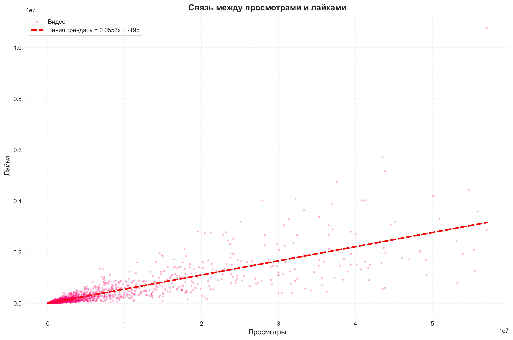
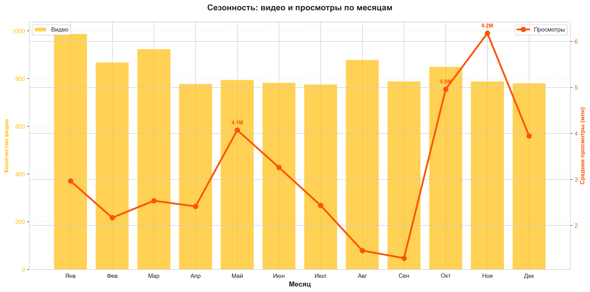
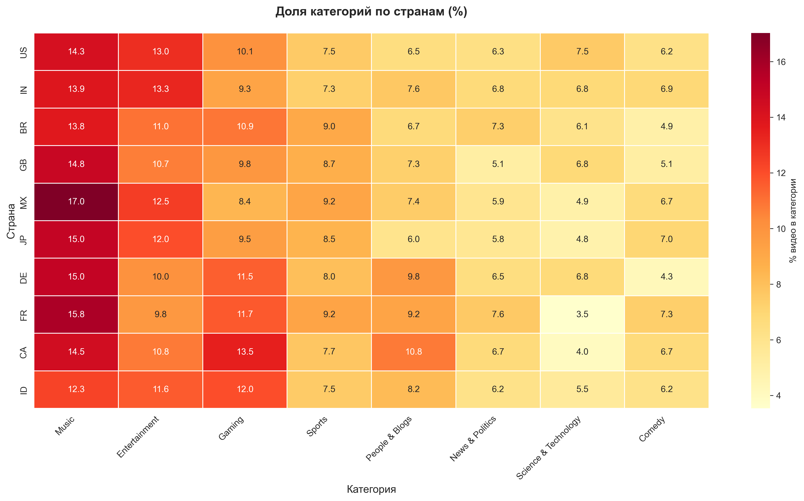

# Анализ трендовых видео на YouTube (2020-2026)

Исследовательский анализ 10 000 трендовых видео: какие паттерны определяют успех на YouTube?

**Кратко:** Анализ показывает, что музыка доминирует глобально (13-17% трендов), 
лайки коррелируют с просмотрами (r=+0.92), а ноябрь — лучший месяц для публикаций.

## Данные

| Файл | Строк | Колонок | Описание |
|------|-------|---------|----------|
| `trending_videos.csv` | 10 000 | 34 | Основные данные о трендовых видео |
| `yearly_trends.csv` | 7 | 11 | Агрегированные данные по годам |
| `country_summary.csv` | 23 | 7 | Статистика по странам |
| `category_summary.csv` | 17 | 11 | Статистика по категориям |

**Источник:** [Kaggle: YouTube Trending Videos 2020-2026](https://www.kaggle.com/datasets/meruvakodandasuraj/youtube-trending-videos-20202026)

## Цель анализа

Исследовать паттерны успешных видео на YouTube:
1.  Какие категории и каналы чаще попадают в тренды?
2.  Какие характеристики видео коррелируют с высоким количеством просмотров?
3.  Как менялись тренды платформы с 2020 по 2026 год?
4.  Различаются ли предпочтения аудитории по странам?
5.  Влияют ли «кликбейтные» заголовки на успех?

### Проанализироованные вопросы:

1. Какие видео набирают больше всего просмотров? 
2. Есть ли связь между лайками и просмотрами? 
3. Есть ли сезонность по месяцам? 
4. Различаются ли предпочтения по странам?

## 1. Какие видео набирают больше всего просмотров? 

### СТАТИСТИКА НА 1000 САМЫХ ПОПУЛЯРНЫХ ВИДЕО

**ПРОИЗВОДИТЕЛЬНОСТЬ:**
- **Просмотры (медиана):** 7,392,116
- **Просмотры (среднее):** 29,022,142
- **Engagement score(показатель вовлеченности):** 7.435

> ⚠️ **Примечание:** Engagement score = 7.435 может быть рассчитан по другой шкале 
> (например, ×100). Для сравнения с другими исследованиями используйте 0.074.

**ВОВЛЕЧЁННОСТЬ:**
- **Like/View ratio:** 5.45%
- **Comment/View ratio:** 0.663%
- **Среднее лайков:** 389,936
- **Среднее комментариев:** 43,291

**КОНТЕНТ:**
- **Категория (мода):** Music
- **Длительность (медиана):** 429 сек (7:09)
- **Кликбейт-скор (среднее):** 0.458
- **Эмодзи в заголовке: 3.4%** видео

**КАНАЛ:**
- **Верифицированный канал:** 97.0%
- **Подписчики (медиана):** 6,178,337

**ВРЕМЯ:**
- **Дней до попадания в тренды (медиана):** 2.0
- **Лучший день для публикации:** Friday

#### ВЫВОДЫ ПО СТАТИСТИКЕ

- Разрыв между медианой и средним по просмотрам в 4 раза(7.4 млн против 29 млн):
  - Есть супер-вирусные видео (50-100+ млн), которые тянут среднее вверх
  - Успех на YouTube не линейный, а экспоненциальный 
- Вовлечённость в 2-3 раза выше нормы(5.45% по лайкам и 0.66% по комментариям)
  - Топ-видео не просто набирают просмотры, а удерживают внимание
  -  Аудитория активно взаимодействует - это сигнал алгоритму о качестве
  -  Высокий engagement = больше рекомендаций = больше просмотров 
- Музыка - самый популярный жанр
  - Музыка не требует перевода, легко потребляется фоном
  - Музыкальные видео чаще становятся вирусными благодаря глобальной аудитории
  - Это структурное преимущество категории
- Оптимальная длина: 7 минут
    - Короткие видео (<3 мин) не успевают вовлечь
    - Длинные видео (>12 мин) теряют внимание
    - 7 минут — баланс между глубиной и удержанием 
- Броский заголовок не главное(3.4% с эмодзи, умеренный кликбейт 0.458)
    - Качество контента важнее визуальных уловок
- Доверие каналу важно
  - Верифицированные каналы: 97%
  - Подписчики (медиана): 6.2 млн
- В среднем 2 дня до попадания в тренды
  - Вирусные видео быстро набирают обороты 
- Самый лучший день для выпуска видео - пятница
  - Пик активности аудитории приходится на начало выходных

## 2. Есть ли связь между лайками и просмотрами? 

Коэффициент корреляции Пирсона: +0.9223 

P-value: 0.00e+00

Итог: Существует **очень сильная положительная связь** во всех популярных категориях между просмотрами и лайками.
В среднем видео получает **~5.5 лайков на каждые 100 просмотров**.

**Практическое значение:**
• Лайки — надёжный индикатор успеха видео
• Алгоритм YouTube может использовать лайки как сигнал качества
• Однако корреляция ≠ причинность: возможно, оба показателя зависят 
  от третьего фактора (качество контента, размер аудитории канала)

## 3. Есть ли сезонность по месяцам?

**Выводы:** 
- сенний пик (Октябрь-Ноябрь). Просмотры в 4.8× выше, чем в сентябре.
- Сентябрьский спад. Самый низкий месяц по всем метрикам.
- Количество видео ≠ Успех
  - Январь: больше всего видео, но средние просмотры.
  - Ноябрь: меньше видео, но максимальные просмотры

## 4. Различаются ли предпочтения по странам? 

**Анализ:** Доля категорий в трендах по 10 странам (n=10 000 видео)

 Универсальные паттерны:
- Music в топ-1 во всех 10 странах 
- Entertainment в топ-2 во всех странах 
- Gaming в топ-3 в 8 из 10 стран
**Статистика:**
- Разброс Music по странам: 38% (от 12.3% до 17.0%)
- Разброс Gaming по странам: 61% (от 8.4% до 13.5%)
- Разброс Science & Tech: 114% (от 3.5% до 7.5%)

**Главный вывод:**
YouTube — глобальная платформа с универсальными паттернами 
(Music, Entertainment, Gaming доминируют везде), но нишевые 
категории сильно зависят от культурных особенностей страны.

